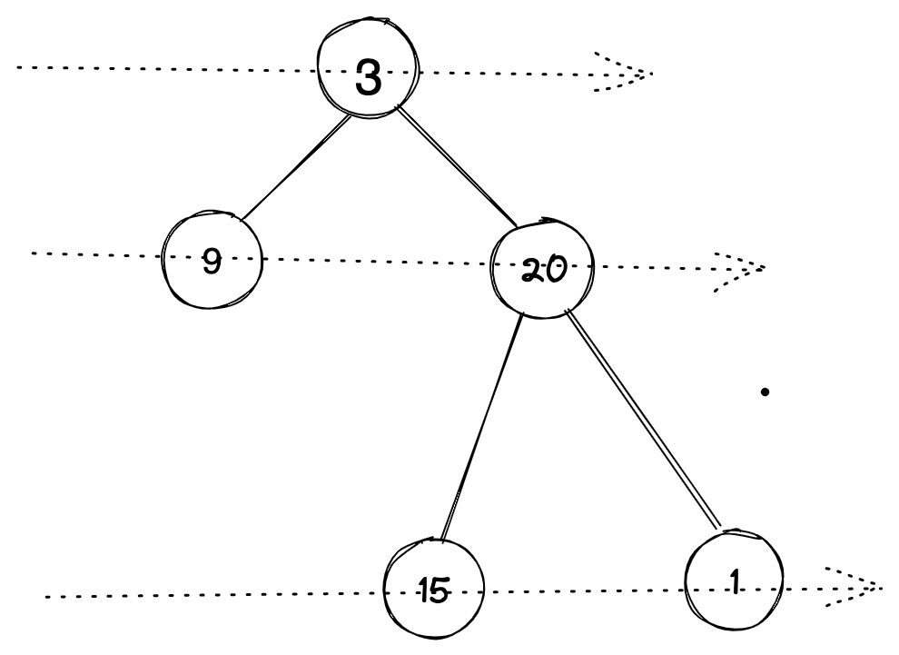

[toc]
## 二叉树的层序遍历
https://leetcode-cn.com/problems/binary-tree-level-order-traversal
题目
二叉树：[3,9,20,null,null,15,7],

```
    3
   / \
  9  20
    /  \
   15   7
```
返回其层序遍历结果：

```
[
  [3],
  [9,20],
  [15,7]
]
```



解题思路：

- 1. 使用递归
- 2. 使用队列

**方法一: 使用递归**

- 确定递归函数
将当前层的所有子节点作为下一次调用的输入

```java
 void recursiveLevelTraversal(List<TreeNode> currentLevelList, List<List<Integer>> result)
```


- 递归结束条件

    是当这一层所有的节点为空

```java
 // 判断条件
if (currentLevelList.size() == 0) {
    return;
}
```
- 递归层中的逻辑
在每一层需要做三件事

    - 1. 每层中需要遍历这一层的所有子节点
    - 2. 将这些子节点添加到列表中，作为下一次调用的输入
    - 3. 这层节点添加到这层的列表中，并添加到 result 中

```
private static void recursiveLevelTraversal(List<TreeNode> currentLevelList, List<List<Integer>> result) {
    // 判断条件
    if (currentLevelList.size() == 0) {
        return;
    }
    // 下一层需要判断的节点
    List<TreeNode> levelList = new ArrayList<>();
    // 当前层的结果
    List<Integer> levelResult = new ArrayList<>(currentLevelList.size());
    for (TreeNode node : currentLevelList) {
        levelResult.add(node.val);
        if (node.left != null) {
            levelList.add(node.left);
        }
        if (node.right != null) {
            levelList.add(node.right);
        }
    }
    // 把当前层的结果添加到返回结果中
    result.add(levelResult);
    // 再次调用递归函数
    recursiveLevelTraversal(levelList, result);
}
```

**方法二：使用迭代法**
方法二是在方法一的基础上进一步改进,将递归改成迭代，每一层将原来使用数组改成用队列的方式，队列先进先出的特点，刚好适合每层从做到右的特点

```java
// 使用队列的版本
private static List<List<Integer>> levelTraversal2(TreeNode root) {
    if (root == null) {
        return Collections.emptyList();
    }
    // 返回结果
    List<List<Integer>> result = new ArrayList<>();
    // 每一层的节点
    Queue<TreeNode> levelQueue = new ArrayDeque<TreeNode>();
    // 先添加第一层
    levelQueue.add(root);

    while (!levelQueue.isEmpty()) {
        // 每层的节点数量
        int levelNodeSize = levelQueue.size();
        // 每一层的节点
        List<Integer> levelNode = new ArrayList<>(levelNodeSize);
        for (int i = 0; i < levelNodeSize; i++) {
            TreeNode node = levelQueue.poll();
            if (node == null) {
                break;
            }
            if (node.left != null) {
                levelQueue.add(node.left);
            }
            if (node.right != null) {
                levelQueue.add(node.right);
            }
            levelNode.add(node.val);
        }
        // 每一层的结果添加到结果中
        result.add(levelNode);
    }

    return result;
}
```
[完整的解题代码](https://github.com/yxhuangCH/LeetCode/blob/master/%E4%BA%8C%E5%8F%89%E6%A0%91/tree/src/main/java/com/yxhuang/tree/level/TreeLevelTraversalPractice.java)

